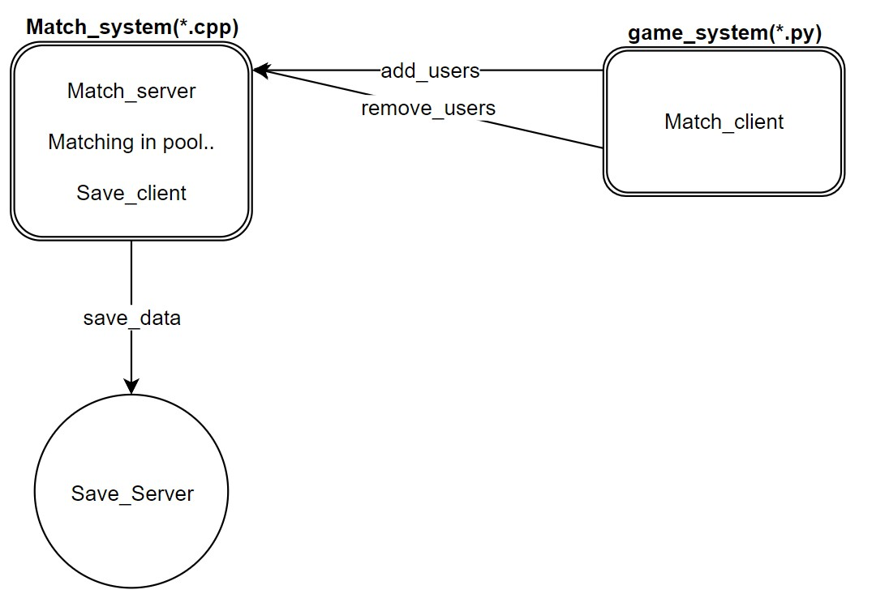

## A framework of thrift

### version1.0:
- The first test for Thrift.

### version2.0:
- Match the first two players every time.Use the conditinon variable to handle the situation of empty task queue.

### version3.0:
- Trying to match two players whose scores differ by no more than `50` every second.Save the result to the Database server.No longer use conditional variable to handle the empty task queue.

### version4.0:
- Add multithreads.

### version5.0:
- Update the match machanism: enlarge the match range according to the waiting time.